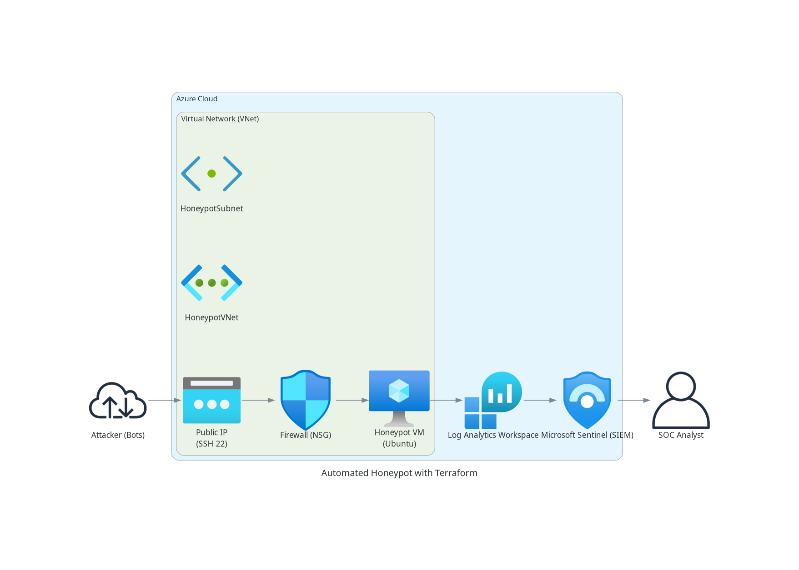
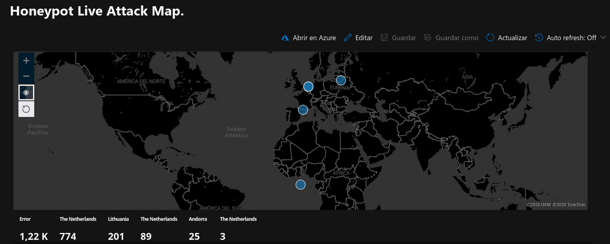
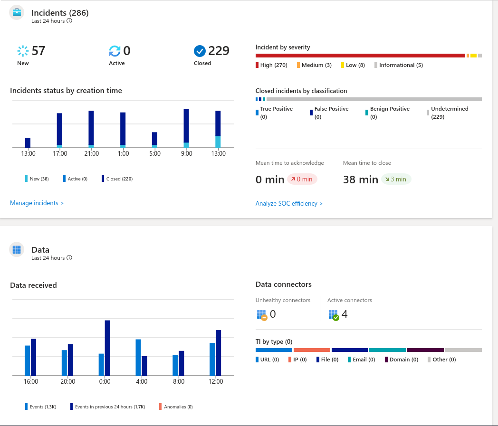
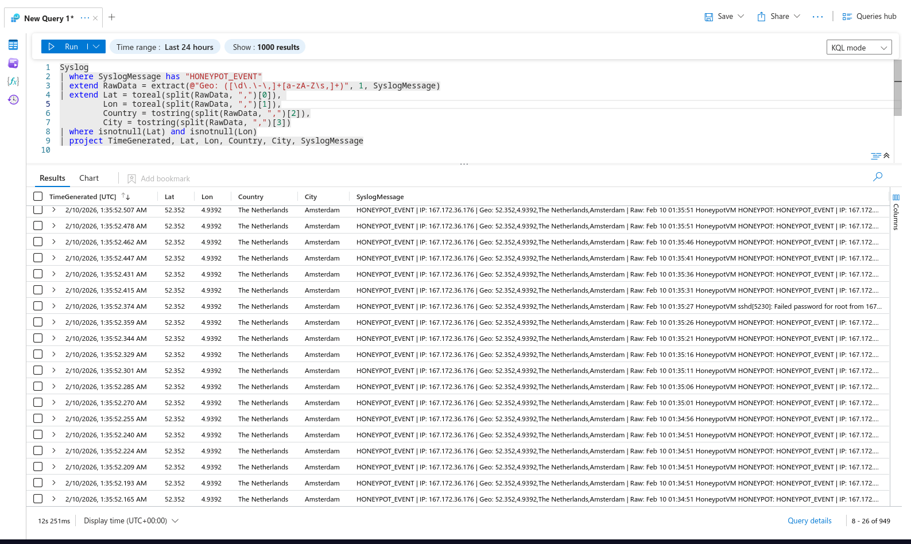

## 👤 Author
**Dante Manríquez Riquelme**
*Informatics Engineering Student at INACAP*


# Azure Sentinel (SIEM) & Automated Honeypot Lab

## Project Overview
This project demonstrates the deployment of a fully functional **Honeypot** in Microsoft Azure to capture and analyze real-time cyber attacks. By utilizing **Terraform** for Infrastructure as Code (IaC) and **Azure Sentinel (SIEM)** for monitoring, this lab provides a comprehensive view of global threat patterns and security incident management.

### Key Objectives
* Deploy a vulnerable Linux instance in a controlled environment to capture attack logs.
* Automate cloud infrastructure using **Terraform (IaC)**.
* Perform geographic threat analysis using **Python** and **KQL (Kusto Query Language)**.
* Implement a professional SOC-like workflow for incident triaging.

---

## Technical Architecture
The lab implements a modern security data pipeline:


1. **Infrastructure:** Azure VM (Ubuntu) provisioned via **Terraform**.
2. **Detection:** A custom **Python script** monitors failed login attempts (RDP/SSH).
3. **Data Enrichment:** Integration with Geolocation APIs to map attacker IP addresses to physical coordinates.
4. **Ingestion:** Data is streamed to a **Log Analytics Workspace** via Syslog.
5. **Visualization:** **Azure Sentinel** correlates the logs to generate live attack maps and security incidents.


---

## Live Attack Metrics & Analysis
During the first 24 hours of deployment, the honeypot recorded significant malicious activity:

* **Total Incidents:** 286 alerts triggered.
* **High Severity:** 94% of incidents categorized as **High/Critical**.
* **Primary Vector:** Brute-force attacks targeting Port 3389.
* **Mean Time to Acknowledge (MTTA):** ~38 minutes.

### Global Attack Map

*Real-time visualization of attacks originating from nodes in Brazil, the Netherlands, and other global regions.*

### 🛡️ Incident Management (Sentinel Dashboard)

*Azure Sentinel dashboard showcasing incident triaging and high-severity alert tracking.*

---

## Tech Stack
* **Cloud Platform:** Microsoft Azure (Sentinel, Log Analytics, Virtual Machines).
* **IaC:** Terraform (HCL).
* **Languages:** Python (Data Processing & API Integration), KQL (Threat Hunting).
* **Operating Systems:** Linux (Ubuntu Server / CachyOS).

---

## Sample KQL Query (Threat Hunting)

To visualize the data, I developed custom KQL queries to parse raw Syslog data:

```kusto
Syslog
| where SyslogMessage has "HONEYPOT_EVENT"
| extend RawData = extract(@"Geo: ([\d\.\-\,]+[a-zA-Z\s,]+)", 1, SyslogMessage)
| extend Lat = toreal(split(RawData, ",")[0]),
         Lon = toreal(split(RawData, ",")[1]),
         Country = tostring(split(RawData, ",")[2])
| where Lat != 0 and Lon != 0
| render scatterchart with (kind=map)

